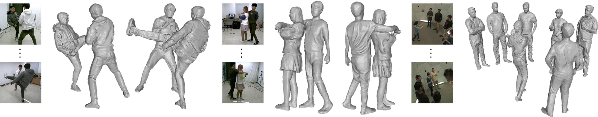

# Advanced Topics in 3D Computer Vision
Repository for the Project of Advanced Topics in 3D Computer Vision

## Uploading To Nextcloud Repository ##

Use the script provided in `scripts/cloudsend.sh` to upload data into the nextcloud repository.\
Make sure to make the script executable if you are on *nix machine.

Example:
```bash
# Upload the folder/file <data> to the nextcloud repository
 ./scripts/cloudsend.sh -p 'fcanys2333' '<data>' 'https://nextcloud.in.tum.de/index.php/s/RjdwM59XHAkWkMC'
```

# Installing EasyMocap #
Download SMPL models:
```
pip install gdown wget
# You might need to rename the HrNet weight file
python scripts/download.py
```

Prepare your Conda environment (if necessary):
```
conda create -n easymocap python=3.9 -y
conda activate easymocap
```

Install appropriate torch and torchvision version:
```
pip install torch==1.13.1+cu117 -f https://download.pytorch.org/whl/torch_stable.html`
pip install torchvision==0.14.1+cu117 -f https://download.pytorch.org/whl/torch_stable.html
```


Install remaining requirements:
```
cd external/EasyMocap-master
python -m pip install -r requirements.txt
python3 -m pip install pyrender
python setup.py develop
```

Convert Dataset into easymocap format (extri and intri still bugged):
```
python scripts/convert_params.py -i data/Synthetic/first_trial/camera_info.json -o data/Synthetic/first_trial_easymocap -d data/Synthetic/first_trial -f 30
```

Extract the images from videos:
```
data=/path/to/data
python scripts/preprocess/extract_video.py ${data} --no2d
```

Create 2D keypoints:
```
python apps/preprocess/extract_keypoints.py ${data} --mode yolo-hrnet
```

Create 3D keypoints:
```
python3 apps/demo/mvmp.py ${data} --out ${data}/output --annot annots --cfg config/exp/mvmp1f.yml --undis --vis_det --vis_repro
```

Track 3D keypoints:
```
python3 apps/demo/auto_track.py ${data}/output ${data}/output-track --track3d
```

Fit SMPL model:
```
python3 apps/demo/smpl_from_keypoints.py ${data} --skel ${data}/output-track/keypoints3d --out ${data}/output-track/smpl --verbose --opts smooth_poses 1e1
```


# [DeepMultiCap: Performance Capture of Multiple Characters Using Sparse Multiview Cameras (ICCV 2021)](http://www.liuyebin.com/dmc/dmc.html)
[Yang Zheng*](https://y-zheng18.github.io/zy.github.io/), Ruizhi Shao*, [Yuxiang Zhang](https://zhangyux15.github.io/), [Tao Yu](http://ytrock.com/), [Zerong Zheng](http://zhengzerong.github.io/), [Qionghai Dai](http://media.au.tsinghua.edu.cn/english/team/qhdai.html), [Yebin Liu](http://www.liuyebin.com/).

[](https://arxiv.org/abs/2105.00261)

This repository contains the official pytorch implementation of ”*DeepMultiCap: Performance Capture of Multiple Characters Using Sparse Multiview Cameras*“.



### News
* **[2021/9/26]** We added more scans to [MultiHuman dataset](https://github.com/y-zheng18/MultiHuman-Dataset). You can use MultiHuman to train/fine-tune our model or your own models!
* **[2021/9/18]** [MultiHuman dataset](https://github.com/y-zheng18/MultiHuman-Dataset) for evaluation purpose is available!

## Requirements
- [PyTorch](https://pytorch.org/)
- torchvision
- trimesh
- numpy
- matplotlib
- PIL
- skimage
- tqdm
- cv2
- json
- taichi==0.6.39 or 0.7.15
- taichi_three
- taichi_glsl==0.0.10

## Pretrained Model
We have provided pretrained model in [One Drive](https://mailstsinghuaeducn-my.sharepoint.com/:u:/g/personal/shaorz20_mails_tsinghua_edu_cn/EdVJtlpRplRHvGzQENV8ESQB4E_0ZY3B9l76XHuEowj1YA?e=MZqUxM)


## Training
To train DeepMultiCap model, please run the following code.
```
sh render_dataset.sh
sh train.sh
```

## Demo
Run the following code to inference on the MultiHuman dataset.
```
sh render_two.sh
sh demo.sh
```

## Citation
```
@inproceedings{zheng2021deepmulticap,
title={DeepMultiCap: Performance Capture of Multiple Characters Using Sparse Multiview Cameras},
author={Zheng, Yang and Shao, Ruizhi and Zhang, Yuxiang and Yu, Tao and Zheng, Zerong and Dai, Qionghai and Liu, Yebin},
booktitle={IEEE Conference on Computer Vision (ICCV 2021)},
year={2021},
}
```
